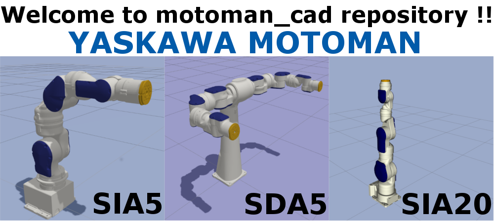

This Repository has [YASKAWA Corp's MOTOMAN](https://www.yaskawa.eu.com/en/products/robotic/motoman-robots/) 3D CAD models.  
At least, every series has STL & COLLADA models and these files are used as [ROS](http://www.ros.org/) description's mesh file.  
**If you have some model like that, please feel free to contribute it !!**

# Models
### SIA5  
[YASKAWA SIA5 page link](https://www.yaskawa.eu.com/en/products/robotic/motoman-robots/productdetail/product/sia5f/)

### SDA5  
[YASKAWA SDA5 page link](https://www.yaskawa.eu.com/en/products/robotic/motoman-robots/productdetail/product/sda5f/)

### SIA20
[YASKAWA SIA20 page link](https://www.yaskawa.eu.com/en/products/robotic/motoman-robots/productdetail/product/sia20f/)
